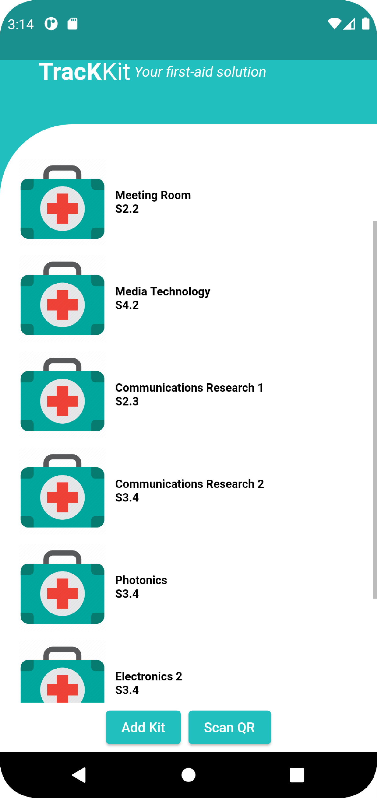
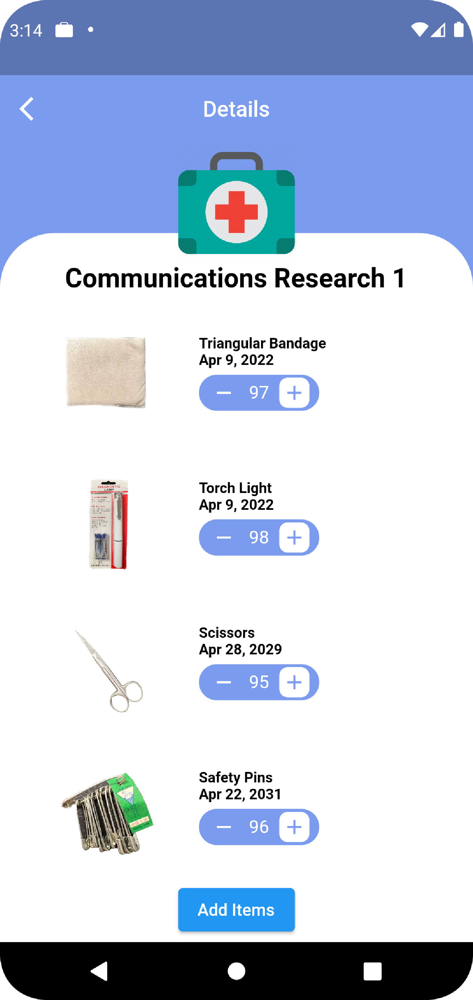
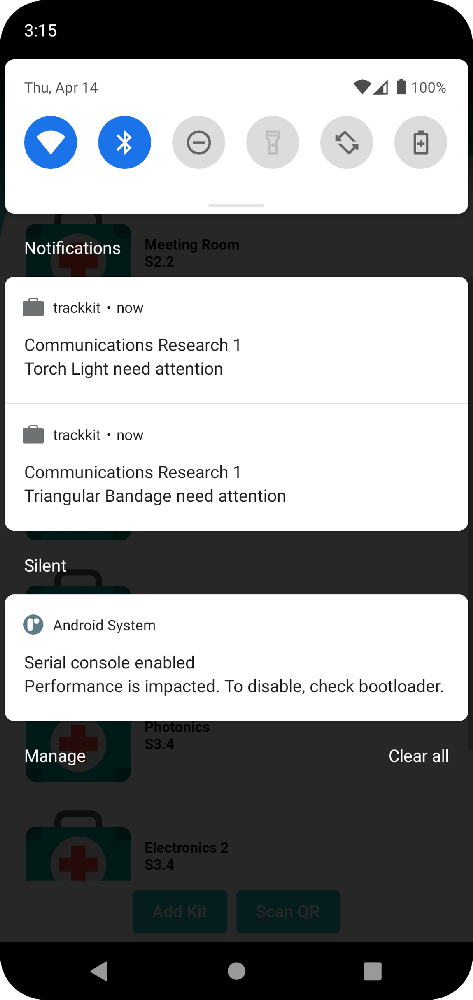

Main Page

Items Page

Specific Notification

Our app is also able to Scan and Identify Items using QR Code. 

Web

One of the Webpage after scanning the unique QR code. User is then able to edit items in the database.

https://trackkit.000webhostapp.com/
