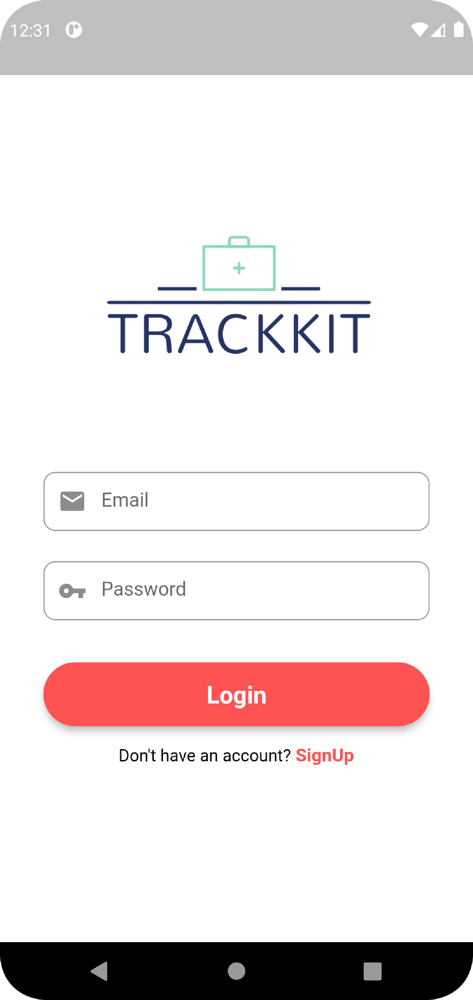
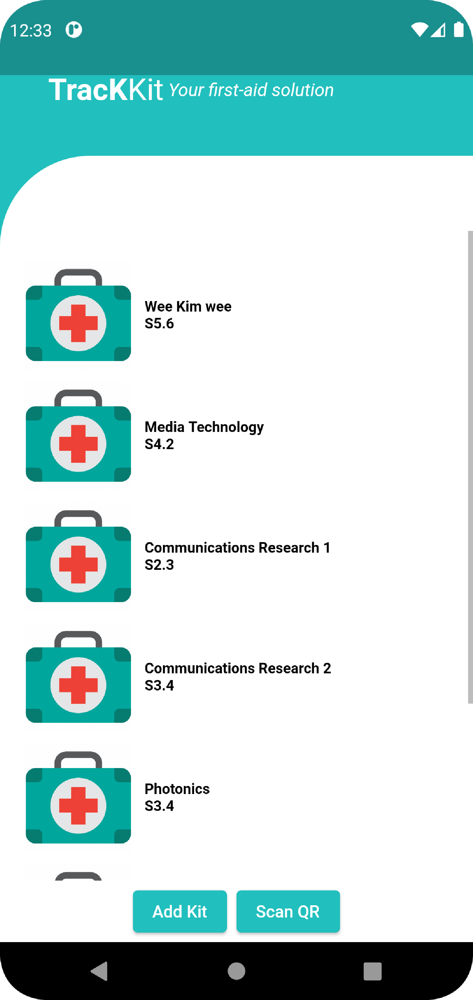
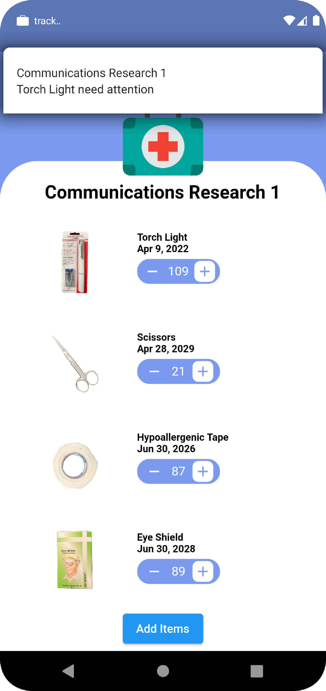
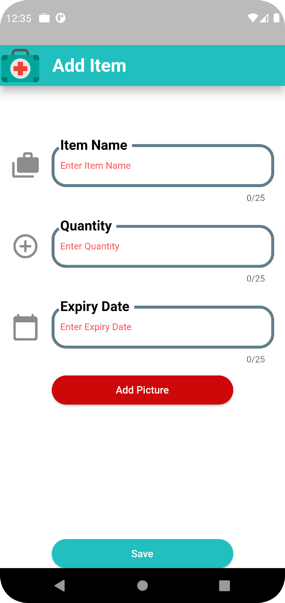

<!-- PROJECT LOGO -->
 

  <h3 align="center">First Aid Tracking System</h3>

<!-- ABOUT THE PROJECT -->
## About The Project
First Aid tracking system for my school ( In use )

### 1. Full Catalogue page, with filtering

### 2. Each Item can have many options. 
### 3. Cart implemented using Sessions

### 4. User have its own account and able to check order history

### 5. If user is logged in as 'Admin', he will able to edit quantity and add new item

### Built With

* 
* 
* 

<!-- CONTRIBUTING -->
## Contributing

Contributions are what make the open source community such an amazing place to learn, inspire, and create. Any contributions you make are **greatly appreciated**.

If you have a suggestion that would make this better, please fork the repo and create a pull request. You can also simply open an issue with the tag "enhancement".
Don't forget to give the project a star! Thanks again!

1. Fork the Project
2. Create your Feature Branch (`git checkout -b feature/AmazingFeature`)
3. Commit your Changes (`git commit -m 'Add some AmazingFeature'`)
4. Push to the Branch (`git push origin feature/AmazingFeature`)
5. Open a Pull Request

<!-- CONTACT -->
## Contact

Stanley - [stanleytanyr@gmail.com](stanleytanyr@gmail.com)

Project Link: [https://github.com/Mushimush/sj-store](https://github.com/Mushimush/sj-store)

